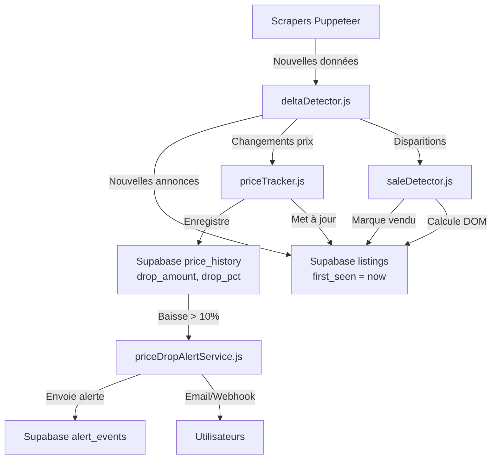

# Configuration Supabase pour Historique des Prix + Détection des Baisses

## ✅ Vérification : Tous les services utilisent Supabase

Tous les services créés utilisent déjà Supabase via `supabase` depuis `../config/supabase.js` :

- ✅ `priceTracker.js` - Utilise `supabase.from('price_history')`
- ✅ `saleDetector.js` - Utilise `supabase.from('listings')`
- ✅ `deltaDetector.js` - Utilise `supabase.from('listings')`
- ✅ `velocityCalculator.js` - Utilise `supabase.from('listings')`
- ✅ `priceDropAlertService.js` - Utilise `supabase.from('alerts')` et `supabase.from('alert_events')`

## 📊 Tables Supabase utilisées

### Table `listings`
Colonnes utilisées pour l'historique des prix :
- `id` (UUID) - Identifiant unique
- `source_listing_id` (VARCHAR) - ID stable de la source
- `source_platform` (VARCHAR) - Source (leboncoin, autoscout24, etc.)
- `price` (DECIMAL) - Prix actuel
- `first_seen` (TIMESTAMP) - **Nouveau** - Date de première apparition
- `sold_date` (TIMESTAMP) - **Nouveau** - Date de vente
- `dom_days` (INTEGER) - **Nouveau** - Days On Market
- `price_drop_amount` (DECIMAL) - **Nouveau** - Montant de la dernière baisse
- `price_drop_pct` (DECIMAL) - **Nouveau** - Pourcentage de la dernière baisse
- `last_price_drop_date` (TIMESTAMP) - **Nouveau** - Date de la dernière baisse
- `status` (VARCHAR) - Statut (active, sold, pending)
- `created_at` (TIMESTAMP) - Date de création
- `updated_at` (TIMESTAMP) - Date de mise à jour

### Table `price_history`
Colonnes utilisées :
- `listing_id` (UUID) - Référence vers `listings.id`
- `price` (DECIMAL) - Prix enregistré
- `recorded_at` (TIMESTAMP) - Date d'enregistrement
- `drop_amount` (DECIMAL) - **Nouveau** - Montant de la baisse
- `drop_pct` (DECIMAL) - **Nouveau** - Pourcentage de la baisse
- `previous_price` (DECIMAL) - **Nouveau** - Prix précédent

### Table `alerts`
Colonnes utilisées pour les alertes de baisse :
- `id` (UUID)
- `user_id` (UUID)
- `criteria` (JSONB) - Critères de l'alerte (brand, model)
- `webhook_url` (TEXT) - URL webhook optionnelle
- `status` (VARCHAR) - Statut (active, inactive)

### Table `alert_events`
Colonnes utilisées :
- `id` (UUID)
- `alert_id` (UUID)
- `user_id` (UUID)
- `event_type` (VARCHAR) - Type d'événement ('price_drop')
- `data` (JSONB) - Données de l'événement
- `created_at` (TIMESTAMP)

## 🚀 Étapes pour activer l'historique des prix

### 1. Exécuter la migration dans Supabase

**Option A : Via SQL Editor (Recommandé)**
1. Ouvrez : https://supabase.com/dashboard/project/jgrebihiurfmuhfftsoa/sql/new
2. Copiez le contenu de `backend/src/database/migrations/011_price_history_enhanced.sql`
3. Collez et exécutez dans le SQL Editor

**Option B : Via script (vérification uniquement)**
```bash
cd backend
node src/scripts/run-migration-011-supabase.js
```

### 2. Vérifier la configuration Supabase

Assurez-vous que votre `.env` contient :
```bash
SUPABASE_URL=https://jgrebihiurfmuhfftsoa.supabase.co
SUPABASE_SERVICE_ROLE_KEY=your_service_role_key_here
```

### 3. Vérifier que les colonnes existent

Exécutez dans Supabase SQL Editor :
```sql
-- Vérifier colonnes listings
SELECT column_name, data_type 
FROM information_schema.columns 
WHERE table_schema = 'public' 
  AND table_name = 'listings'
  AND column_name IN ('first_seen', 'sold_date', 'dom_days', 'price_drop_amount', 'price_drop_pct', 'last_price_drop_date');

-- Vérifier colonnes price_history
SELECT column_name, data_type 
FROM information_schema.columns 
WHERE table_schema = 'public' 
  AND table_name = 'price_history'
  AND column_name IN ('drop_amount', 'drop_pct', 'previous_price');
```

### 4. Tester le système

1. **Redémarrer le serveur backend** :
   ```bash
   cd backend
   npm run dev
   ```

2. **Tester l'historique des prix** :
   - Allez sur une page de détail d'annonce
   - Vérifiez que le graphique d'historique s'affiche

3. **Tester la détection de baisses** :
   - Scrapez une annonce avec un prix qui change
   - Vérifiez que le badge "Prix baissé" apparaît dans la liste

4. **Tester les alertes** :
   - Créez une alerte pour un modèle
   - Attendez qu'une baisse de prix soit détectée
   - Vérifiez que l'email/webhook est envoyé

## 📝 Flux de données dans Supabase



## 🔍 Requêtes Supabase utiles

### Voir l'historique des prix d'une annonce
```sql
SELECT price, recorded_at, drop_amount, drop_pct, previous_price
FROM price_history
WHERE listing_id = 'your-listing-id'
ORDER BY recorded_at DESC;
```

### Voir les baisses de prix récentes
```sql
SELECT 
  l.brand,
  l.model,
  l.year,
  l.price_drop_pct,
  l.price_drop_amount,
  l.last_price_drop_date
FROM listings l
WHERE l.price_drop_pct IS NOT NULL
  AND l.last_price_drop_date >= NOW() - INTERVAL '7 days'
ORDER BY l.price_drop_pct DESC
LIMIT 20;
```

### Voir les modèles les plus vendus
```sql
SELECT 
  brand,
  model,
  COUNT(*) as sales_count,
  AVG(dom_days) as avg_dom,
  AVG(price) as avg_price
FROM listings
WHERE status = 'sold'
  AND sold_date >= NOW() - INTERVAL '30 days'
GROUP BY brand, model
ORDER BY sales_count DESC
LIMIT 20;
```

## ✅ Checklist de vérification

- [ ] Migration 011 exécutée dans Supabase SQL Editor
- [ ] Colonnes `first_seen`, `sold_date`, `dom_days` existent dans `listings`
- [ ] Colonnes `drop_amount`, `drop_pct`, `previous_price` existent dans `price_history`
- [ ] Index créés (vérifier avec la requête de vérification)
- [ ] Variables d'environnement Supabase configurées
- [ ] Serveur backend redémarré
- [ ] Test d'historique des prix fonctionne
- [ ] Test de badge "Prix baissé" fonctionne
- [ ] Test d'alertes fonctionne

## 🎯 Prochaines étapes

Une fois la migration appliquée :

1. **Activer le cron job quotidien** :
   - Le job `dailyScraping.js` tournera automatiquement à 6h du matin
   - Vérifier `ENABLE_DAILY_SCRAPING` dans `.env`

2. **Configurer les alertes** :
   - Les utilisateurs peuvent créer des alertes pour des modèles
   - Les baisses > 10% déclencheront automatiquement des notifications

## 📚 Documentation

- Migration SQL : `backend/src/database/migrations/011_price_history_enhanced.sql`
- Instructions migration : `backend/MIGRATION_011_SUPABASE.md`
- Script de vérification : `backend/src/scripts/run-migration-011-supabase.js`

---

**Tous les services sont déjà configurés pour utiliser Supabase !** Il suffit d'exécuter la migration pour activer les fonctionnalités.
